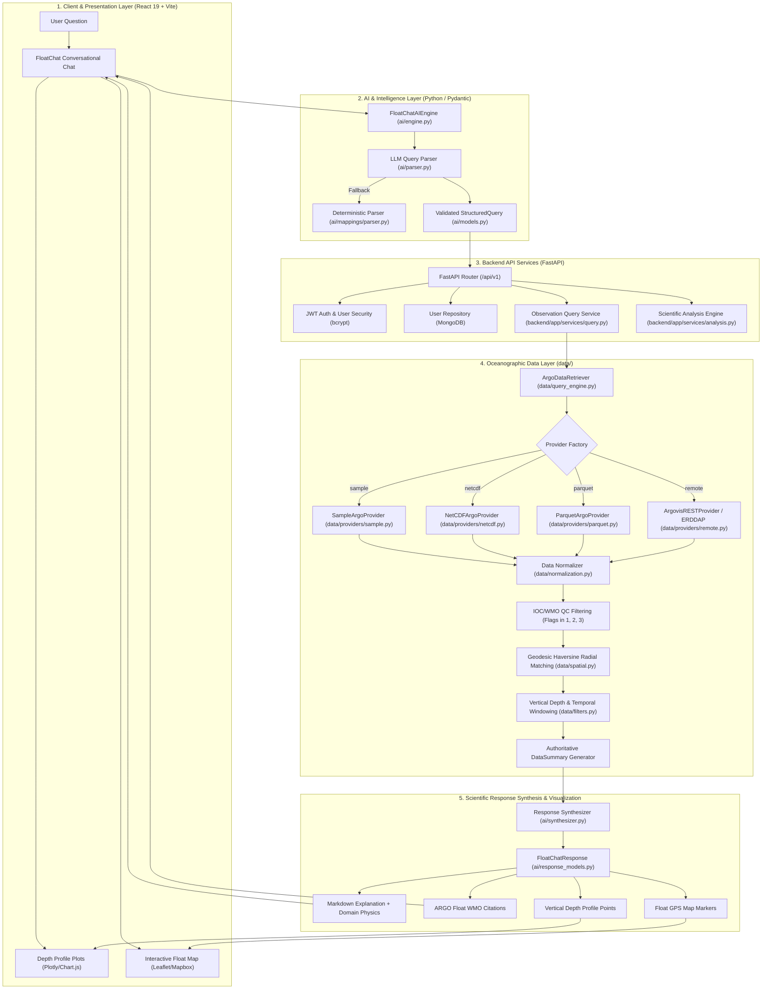

<div align="center">

# 🌊 FloatChat

### **Ask the Ocean. Understand the Risk.**

[](https://github.com)
[](https://python.org)
[](https://fastapi.tiangolo.com)
[](https://react.dev)
[](tests/)
[](LICENSE)

*An AI-powered conversational ocean and environmental intelligence platform bridging autonomous ARGO profiling floats, physical oceanography, and natural-language decision support.*

---

[Explore Architecture](#-system-architecture) • [Ocean Data](#-ocean-data-the-argo--erddap-layer) • [API Reference](#-api-reference--integration-contracts) • [Testing](#-testing--validation) • [Getting Started](#-getting-started--local-setup)

---

</div>

## 🌍 The Problem

Every second, thousands of robotic sensors, satellites, and autonomous profiling floats record the physical pulse of our oceans. The **international ARGO Program** maintains over 4,000 active robotic floats worldwide, continually measuring temperature, practical salinity, hydrostatic pressure, and biogeochemical markers from the sea surface down to 2,000 meters.

Yet, despite this abundance of vital data:

> ### **"Data is everywhere. Understanding is not."**

1. **Complex Scientific Formats:** Raw oceanographic observations are distributed in multidimensional NetCDF binary files, raw telemetry feeds, and complex ERDDAP tables inaccessible to non-specialists.
2. **Specialized Oceanographic Terminology:** Questions about thermoclines, salinity barrier layers, mixed layer depths (MLD), and coastal upwelling require domain expertise to formulate into database queries.
3. **The Climate Resilience Gap:** Coastal communities, environmental managers, disaster preparedness agencies, and climate researchers cannot afford hours of custom scripting to extract simple situational awareness.

---

## 💡 The FloatChat Solution

**FloatChat** transforms complex oceanographic datasets into a conversational, human-accessible intelligence platform. Users ask questions in plain natural language, while FloatChat's grounded AI engine parses intent, retrieves quality-controlled ARGO float profiles, computes authoritative statistics, and synthesizes clear, actionable insights.

```text
User Natural-Language Question
              ↓
   AI Intent Understanding
              ↓
  Structured Oceanographic Query
              ↓
       FastAPI Backend
              ↓
    ARGO / ERDDAP Data Layer
              ↓
     Scientific Analysis
              ↓
Human-Readable Insight + Visualization
```

---

## 🧠 System Architecture

FloatChat is built with a strictly decoupled, modular architecture designed for high scalability, zero-hallucination factual integrity, and format-agnostic data access:



---

## 🌊 Ocean Data: The ARGO & ERDDAP Layer

> **"ARGO provides environmental observations. FloatChat provides the intelligence layer that helps users query and understand those observations."**

### Supported Oceanographic Parameters

FloatChat standardizes raw sensor observations into strongly typed variables:

| Variable Code | Oceanographic Parameter | Standard Units | Physical Significance |
| :--- | :--- | :--- | :--- |
| `TEMP` | Sea Water Temperature | Degree Celsius (`°C`) | In-situ temperature measured on ITS-90 scale |
| `PSAL` | Practical Salinity | `PSU` | Salinity measured on Practical Salinity Scale (PSS-78) |
| `PRES` | Hydrostatic Pressure | Decibars (`dbar`) | Sea water pressure ($1\text{ dbar} \approx 0.993\text{ m depth}$) |
| `DOXY` | Dissolved Oxygen | `µmol/kg` | Dissolved oxygen concentration (BGC-Argo) |
| `CHLA` | Chlorophyll-A | `mg/m³` | Phytoplankton fluorescence proxy (BGC-Argo) |
| `NITRATE` | Nitrate Concentration | `µmol/kg` | Essential macronutrient concentration |
| `PH_IN_SITU_TOTAL` | In-Situ Ocean pH | Total scale | Ocean acidification tracking |
| `BBP700` | Particle Backscattering | `m⁻¹` | Turbidity and particulate concentration |

### Quality Control (QC) & Data Integrity Standards
- Adheres to **IOC/WMO ARGO Quality Control standards**.
- Retains measurements tagged **`QC = 1` (Good)**, **`QC = 2` (Probably Good)**, or **`QC = 3` (Potentially Correctable)**.
- Automatically discards sensor spikes **`QC = 4` (Bad)** and missing data **`QC = 9` (Missing)**.
- Sanitizes numeric sentinel fill values (`99999.0`, `-999.0`, `1e36`, `NaN`) before statistical calculation.

---

## ⚙️ Technology Stack

### **Frontend / Product UI**
- **React 19 & Vite:** Next-generation frontend build tooling with hot module replacement (HMR).
- **Modern Web Standards:** Fluid CSS grid/flexbox layouts, responsive design, and accessible components.
- **Visualization Connectors:** Structured contracts for Plotly/Chart.js depth profiles and Leaflet/Mapbox maps.

### **Backend & APIs**
- **FastAPI:** High-performance, asynchronous Python web framework with auto-generated OpenAPI documentation.
- **Pydantic v2:** Strict data validation, domain modeling, and schema enforcement.
- **MongoDB & Motor:** Document database and asynchronous driver for user accounts and query histories.
- **Security & Auth:** OAuth2 JWT Bearer tokens with `bcrypt` cryptographic password hashing.

### **AI & Natural Language Processing**
- **Google Gemini API / Multi-LLM Abstraction:** Flexible provider architecture (`GeminiLLMClient`, `MockLLMClient`).
- **Deterministic Fallback Engine:** 100% offline regex and coordinate resolution dictionary for uninterrupted availability.
- **Grounded Scientific Synthesizer:** Enforces zero hallucinations by injecting pre-computed mathematical summaries.

### **Oceanographic Data & Scientific Computing**
- **Geodesic Spatial Engine:** Great-circle Haversine radial distance and bounding box calculations.
- **Multi-Format Ingestion:** GDAC NetCDF (`*.nc`), columnar Apache Parquet (`*.parquet`), and public REST APIs (Argovis v3 / ERDDAP).

### **Testing & Quality Assurance**
- **Pytest:** Comprehensive unit, integration, and mocked API test suites with **138 tests passing (100%)**.

---

## 📡 API Reference & Integration Contracts

The backend exposes RESTful endpoints at `/api/v1`:

### Core Endpoints Overview

| Category | Method | Route | Description | Auth |
| :--- | :---: | :--- | :--- | :---: |
| **Health** | `GET` | `/api/v1/health` | System health and database connectivity | None |
| **Auth** | `POST` | `/api/v1/auth/register` | Register new user account | None |
| **Auth** | `POST` | `/api/v1/auth/token` | Authenticate and obtain JWT access token | None |
| **Auth** | `GET` | `/api/v1/auth/me` | Retrieve authenticated user profile | Bearer |
| **Observations** | `POST` | `/api/v1/observations/query` | Filter observations by lat, lon, depth, time, variable | Optional |
| **Observations** | `GET` | `/api/v1/observations/nearby` | Spatial observation discovery around a point | None |
| **Floats** | `GET` | `/api/v1/floats/nearby` | Discover active ARGO float platforms near coordinates | None |
| **Analysis** | `POST` | `/api/v1/analysis/statistics` | Compute authoritative descriptive statistics (mean/min/max) | Optional |
| **Analysis** | `POST` | `/api/v1/analysis/profile` | Generate ordered vertical depth profiles | Optional |
| **Analysis** | `POST` | `/api/v1/analysis/compare` | Compare observations between two floats/water masses | Optional |
| **Analysis** | `POST` | `/api/v1/analysis/trend` | Calculate temporal trends over time intervals | Optional |

*For complete payload schemas and curl examples, see [`docs/api.md`](docs/api.md).*

---

## 🧪 Testing & Validation

FloatChat includes a comprehensive, verified test suite running entirely offline with zero external network dependencies:

```powershell
python -m pytest -q
```

```text
........................................................................ [ 52%]
..................................................................       [100%]
138 passed in 2.23s
```

### Verified Test Coverage
- **30 Tests:** Deterministic natural language query parser & coordinate resolution.
- **26 Tests:** LLM query interpreter, system prompts, and JSON schema extraction.
- **28 Tests:** Geodesic Haversine filtering, depth tolerances, temporal matching, and QC sanitization.
- **24 Tests:** Multi-format ARGO providers (NetCDF parsing, Parquet pushdown, Argovis REST mock).
- **18 Tests:** AI response synthesizer, provenance citations, depth chart payloads, and async chat pipelines.
- **12 Tests:** Backend authentication, JWT security, and user repository operations.

---

## 📊 Current Development Status

| Component | Status | Description |
| :--- | :---: | :--- |
| **AI Query Parser** | 🟢 Built | LLM interpretation with deterministic coordinate fallback |
| **Data Retrieval Layer** | 🟢 Built | Geodesic Haversine matching, depth slices, temporal filtering |
| **ARGO Data Providers** | 🟢 Built | NetCDF, Parquet, Argovis REST, and in-memory sample datasets |
| **Scientific Analysis** | 🟢 Built | Authoritative descriptive statistics (mean, min, max, std) |
| **Response Synthesizer** | 🟢 Built | Grounded Markdown narratives, citations, charts, map markers |
| **FastAPI Backend Core** | 🟢 Built | API routers, observation query service, analysis endpoints |
| **Authentication & Database** | 🟢 Built | JWT authentication with MongoDB user repository |
| **React Frontend Foundation** | 🟢 Built | React 19 + Vite application structure and assets |
| **Frontend ↔ Backend Integration** | 🔵 Integrating | Connecting React UI to FastAPI observation endpoints |
| **AI ↔ Backend Integration** | 🔵 Integrating | Exposing `FloatChatAIEngine.chat()` over FastAPI `/api/v1/chat` |
| **Live Global ARGO Deployment** | 🟡 In Progress | Connecting production Argovis API keys and cloud deployment |

---

## 🖼️ Product Interface & Screenshots

<div align="center">

| Conversational Intelligence | Environmental Data Visualization |
| :---: | :---: |
| *Natural language oceanographic Q&A with float citations* | *High-resolution vertical depth profiles (Depth vs. Salinity/Temp)* |
| *(Screenshots located in [`docs/screenshots/`](docs/screenshots/))* | *(Screenshots located in [`docs/screenshots/`](docs/screenshots/))* |

| Risk & Sensor Map | Environmental Signals & Analysis |
| :---: | :---: |
| *Geospatial tracking of active ARGO profiling floats* | *Descriptive statistics, MLD indicators, and regional comparisons* |
| *(Screenshots located in [`docs/screenshots/`](docs/screenshots/))* | *(Screenshots located in [`docs/screenshots/`](docs/screenshots/))* |

</div>

---

## 👤 User Journey Example

```text
USER PROMPT
"What is the salinity near Chennai at 100 meters?"
       │
       ▼
AI INTERPRETATION
- Intent: profile_query
- Location: Chennai (13.0827°N, 80.2707°E, Radius: 50 km)
- Target Depth: 100.0 m
- Parameter: PSAL (Practical Salinity)
       │
       ▼
DATA RETRIEVAL
- Scans ARGO dataset using Geodesic Haversine formula
- Matches Float WMO 2903334 (Cycle 42) at 20.4 km offshore
- Filters depth level: 99.3 m (Hydrostatic Pressure: 100.0 dbar)
- Validates QC flag: Good (1)
       │
       ▼
SCIENTIFIC ANALYSIS
- Salinity: 34.78 PSU | In-situ Temperature: 24.20 °C
- Pre-computes regional mean: 34.815 PSU (Min: 34.78, Max: 34.85)
       │
       ▼
FLOATCHAT RESPONSE
"Near Chennai at a depth of 100 meters, practical salinity is 34.78 PSU
(with temperature of 24.20°C), as measured by ARGO float 2903334.

Oceanographic Context: In the western Bay of Bengal, a low-salinity surface
lens from monsoon precipitation and river runoff overlays saltier subsurface
waters entering from the Arabian Sea, creating a distinct vertical barrier layer."
```

---

## 🌎 From Data to Resilience

```text
Raw Environmental Data ──► Understanding ──► Risk Signals ──► Decision Support ──► Climate Resilience
```

FloatChat does not claim to predict complex natural disasters. Instead, it provides a scientifically grounded **environmental intelligence layer** that makes ocean observations immediately accessible, interpretable, and actionable.

### Practical Applications
- **Marine Heatwaves & Thermal Stress:** Identifying surface and subsurface temperature anomalies affecting coral reefs and coastal fisheries.
- **Monsoon & Salinity Dynamics:** Monitoring freshwater lenses and salinity barrier layers in the Bay of Bengal that influence tropical cyclone intensification.
- **Ocean Acidification & Oxygen Minimums:** Tracking BGC-Argo pH and dissolved oxygen levels in sensitive coastal ecosystems.

---

## 🗺️ Roadmap

### 🟢 Completed
- [x] Natural language oceanographic query parser with deterministic coordinate dictionary.
- [x] IOC/WMO quality control sanitization (Flags 1, 2, 3 valid; discards 4, 9, FillValues).
- [x] Geodesic Haversine radial distance matching and vertical depth filtering.
- [x] Interchangeable ARGO data providers (NetCDF, Parquet, Argovis REST, In-Memory).
- [x] Grounded scientific response synthesizer with citations, depth chart data, and map markers.
- [x] FastAPI observation query and scientific analysis service endpoints.
- [x] JWT authentication and MongoDB user repository.
- [x] 138-test automated testing suite passing at 100%.

### 🔵 Current Integration
- [ ] Binding FastAPI `POST /api/v1/chat` directly to `FloatChatAIEngine.chat()`.
- [ ] Connecting React frontend chat UI with Plotly/Chart.js depth visualizations.
- [ ] Interactive Leaflet/Mapbox map component rendering ARGO float markers.

### ⚪ Next
- [ ] Direct integration with live Copernicus Marine Service (CMEMS) satellite data.
- [ ] Automated marine heatwave anomaly alerts and notification webhooks.
- [ ] Multi-turn conversational memory with context persistence.
- [ ] Docker Compose orchestration and cloud deployment to staging.

---

## 👥 Team

Developed with passion for the **Dominion Hackathon – Track 6 (Climate & Ocean Intelligence)**:

- **Frontend / Product UI:** User experience, conversational chat interface, interactive maps, and responsive chart components.
- **Backend / Ocean Data Infrastructure:** FastAPI architecture, ERDDAP integration, observation query service, MongoDB repositories, and JWT authentication.
- **AI / Intelligence Layer:** Natural language query understanding, prompt engineering, oceanographic terminology mappings, geodesic filtering, and grounded response synthesis.

---

## 🎬 Demo

[](YOUR_DEMO_LINK)

*(Placeholder: Replace `YOUR_DEMO_LINK` with the final demo recording URL)*

### What the Demo Showcases:
1. **Natural Language Querying:** Asking complex oceanographic questions in plain English.
2. **Real ARGO Float Matching:** Live geographic and depth filtering over ocean observations.
3. **Scientific Explanations:** Grounded physical oceanography insights without hallucinations.
4. **Data Provenance:** Direct citations of ARGO float WMO numbers and observation timestamps.
5. **Interactive Visualizations:** Instant depth profile plots and geospatial float locations.

---

## 🚀 Getting Started & Local Setup

### Prerequisites
- **Python:** 3.11+ (Python 3.12 / 3.13 / 3.14 fully supported)
- **Node.js:** v18+ & npm (for frontend)
- **Git**

### 1. Clone Repository & Setup Virtual Environment
```bash
git clone https://github.com/your-username/FloatChat.git
cd FloatChat

# Create virtual environment
python -m venv .venv

# Activate virtual environment
# On Linux / macOS:
source .venv/bin/activate
# On Windows (PowerShell):
.\.venv\Scripts\Activate.ps1

# Copy environment template
cp .env.example .env
```

### 2. Install Dependencies & Run Tests
```bash
# Install backend and test requirements
pip install -r backend/requirements.txt
# (or install root dependencies: pip install pytest pydantic)

# Run complete test suite (138 tests)
python -m pytest -q
```

### 3. Run the AI / Data Engine in Python
```python
from ai.engine import FloatChatAIEngine

engine = FloatChatAIEngine()
response = engine.chat("What is the salinity near Chennai at 100 meters?")
print(response.answer)
```

### 4. Run the FastAPI Backend Server
```bash
uvicorn backend.app.main:app --host 0.0.0.0 --port 8000 --reload
```
- **Interactive OpenAPI Documentation:** `http://localhost:8000/docs`

### 5. Run the React Frontend
```bash
cd frontend
npm install
npm run dev
```
- **Web UI:** `http://localhost:5173`

---

## 📄 Documentation Sitemap

- [`docs/architecture.md`](docs/architecture.md) — Detailed system architecture and data flows.
- [`docs/api.md`](docs/api.md) — Complete REST API reference and request/response schemas.
- [`docs/data-sources.md`](docs/data-sources.md) — ARGO variables, ERDDAP integration, and QC flags.
- [`docs/ai-pipeline.md`](docs/ai-pipeline.md) — NLP understanding and grounded response synthesis.
- [`docs/setup.md`](docs/setup.md) — In-depth local development and deployment guide.
- [`docs/screenshots/`](docs/screenshots/) — Visual assets and product captures.

---

## 📜 License

This project is licensed under the MIT License — see the [LICENSE](LICENSE) file for details.
