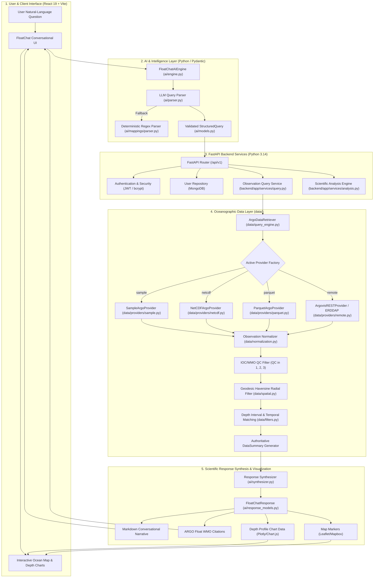

# FloatChat System Architecture

FloatChat is an AI-powered conversational ocean and environmental intelligence platform designed to bridge the gap between complex global oceanographic observations and actionable environmental insights.

---

## 1. End-to-End System Architecture

The diagram below represents the unified architecture connecting the **Frontend Interface**, **AI/LLM Intelligence Layer**, **FastAPI Backend Services**, **Ocean Data Engine**, and **Scientific Analysis Infrastructure**:



---

## 2. Core Architectural Principles

### 1. Zero Hallucination Guarantee
The AI layer never invents, estimates, or fabricates oceanographic measurements. All statistical values (`mean`, `min`, `max`, `std`, observation counts, and depth bounds) are calculated strictly in pure Python over quality-controlled ARGO observations and passed to the response synthesizer as immutable facts.

### 2. Format-Agnostic Ocean Data Abstraction
The data layer decouples the query engine from physical storage formats through the `BaseArgoProvider` interface. The system seamlessly queries:
- Standard Global Data Assembly Center (GDAC) NetCDF files (`*_prof.nc`)
- Columnar Apache Parquet datasets with filter pushdown
- Live REST APIs (Argovis v3 and NOAA/IFREMER ERDDAP)
- Deterministic in-memory sample datasets for local testing and CI

### 3. Graceful Resilience & Dual-Mode Fallbacks
- **Query Parsing:** If the LLM provider times out or encounters network limits, the parser falls back to the deterministic regex engine without failing the request.
- **Response Synthesis:** If LLM synthesis is unavailable, the deterministic template synthesizer generates a structured, domain-accurate Markdown explanation grounded in the data summary.

---

## 3. Data Pipeline Lifecycle

```text
User Question: "What is the salinity near Chennai at 100 meters?"
      │
      ▼
1. AI Query Interpretation:
   StructuredQuery(
       intent=PROFILE_QUERY,
       parameters=[PSAL],
       location=LocationFilter(latitude=13.0827, longitude=80.2707, radius_km=50.0),
       depth=DepthFilter(target_depth=100.0)
   )
      │
      ▼
2. Spatial Pushdown & Provider Query:
   Calculates coarse bounding box [12.63°N, 79.81°E, 13.53°N, 80.73°E]
   Loads raw observation records from active provider
      │
      ▼
3. Normalization & Quality Control:
   - Sanitizes FillValues (99999.0) and NaNs
   - Converts ARGO Julian days relative to 1950-01-01 UTC
   - Retains records where QC in {1, 2, 3}
      │
      ▼
4. Geodesic & Depth Matching:
   - Haversine distance verification: d(query, obs) ≤ 50.0 km
   - Nearest vertical depth level selection: 100.0m ± 20m tolerance
      │
      ▼
5. Authoritative Metrics Generation:
   DataSummary(count=2, mean_salinity=34.82 PSU, min=34.78, max=34.85, platforms=['2903334'])
      │
      ▼
6. Response Synthesis:
   FloatChatResponse(
       answer="Near Chennai at 100m, practical salinity is 34.78 PSU...",
       citations=[FloatCitation(platform_id='2903334', timestamp='2025-01-15T06:00:00Z')],
       chart_data=ChartDataPayload(parameter='PSAL', points=[(100.0m, 34.78 PSU)]),
       map_markers=[MapMarker(lat=13.15, lon=80.45, title='Float 2903334')]
   )
```
